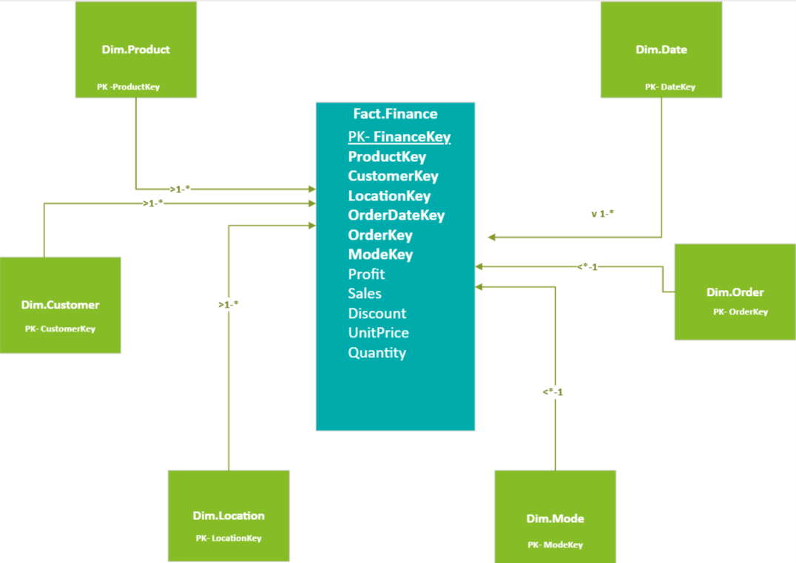
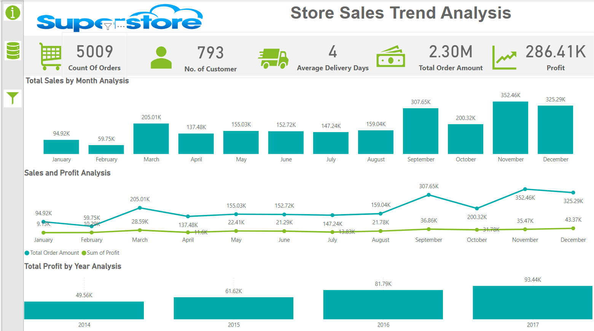
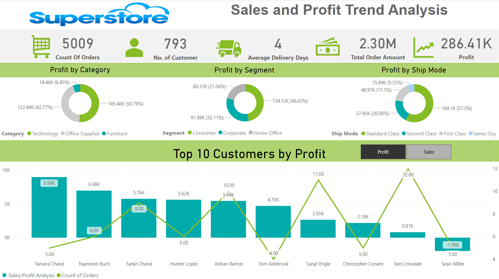
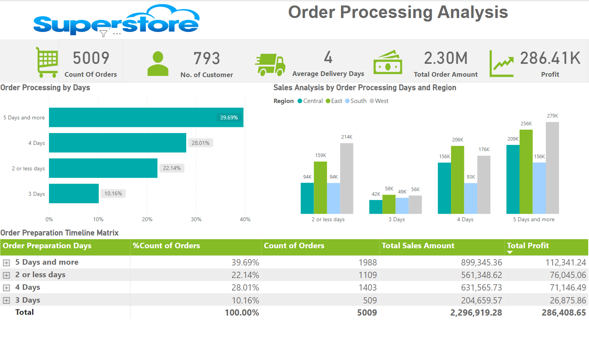

# Power-BI-Super-Store-Dashboard
This is my Power BI Project for the University of South Florida Master Program in Aritficial Intelligence and Business Analytics

## Project Overview

This Power BI project aims to analyze the sales, profit, and performance of various product categories and segments in a Super Store. The project utilizes the Super Store dataset to provide insights into key performance metrics, sales trends, and geographical distribution of sales and profits.

## Problem Statement

HCC Consultant has been hired to present a BI framework to a Super Store Organization. The Super Store organization is interested in using business intelligence solutions to help with strategic decision-making and has asked to demonstrate how Business Intelligence tools can analyze their data from a public dataset.

## Solution

Analyze a large dataset to provide key insights by creating a Power BI Dashboard/Report and develop data-driven processes to find outliers, trends, and patterns. 

### Few Initial Problems Solved

- Identified a constant decline in sales followed by a sudden spike and later a sudden drop.
- Found outliers in Sales Analysis.
- Discovered key insights in package processing time.

## Research Questions

1. How do monthly sales and profit trends vary over the years, and what seasonal patterns can be identified?
2. Which customer segments and top customers contribute most significantly to the overall profit, and how can this influence customer retention strategies?
3. What is the impact of order processing time on sales and profitability across different regions?

## Data Sources

- **Kaggle Super Store Dataset:** [Super Store Dataset](https://www.kaggle.com/datasets/itssuru/super-store)

## Project Files

- `Super Store Executive Dashboard.pbix`: Power BI report file.
- `User Guide- Super Store Executive Dashboard/`: Directory containing project User Guide.

## Project Structure

- **Tab 0: Overview**: Introduction and background of the project.
- **Tab 1: Sales Trend Analysis**: Analysis of total sales by month, sales and profit trends.
- **Tab 2: Sales and Profit Trend Analysis**: Analysis of profit by category, segment, and ship mode; top 10 customers by profit.
- **Tab 3: Order Processing Analysis**: Analysis of order processing by days, sales by order processing days and region, order preparation timeline matrix.

## Data Model Blueprint

The relational database warehousing uses the Star Schema layout. The Star Schema is named for its resemblance to a star, with a central Fact table called the Transactional table. This table mainly contains transactional data like Profit, Sales, Cost, Quantity, and Keys. The fact table's primary key is typically a foreign key in each of the dimension tables and uniquely identifies each row of data in the fact table. Surrounding the Fact table are all Dimension tables, which are defined as business entities containing attributes such as Product, Employee, Location, Customer, etc.

## Visualizations for Research Questions 1

### Sales Trend Analysis
- **Count of Orders, Number of Customers, Average Delivery Days, Total Order Amount, and Sum of Profit**: KPIs.
- **Total Sales by Month Analysis**: Bar Chart showing sales by month.
- **Sales and Profit Analysis**: Line and Bar Chart showing sales and profit trends.
- **Total Profit by Year Analysis**: Bar Chart showing profit by year.

### Q1. How do monthly sales and profit trends vary over the years, and what seasonal patterns can be identified?
Monthly Sales and Profit Trends

#### Explanation
High-Performing Months:
March: Sales peaked at 205.01K, with profits reaching 28.59K, likely due to end-of-quarter sales drives.
September: Sales were 307.65K, and profits were 36.86K, influenced by back-to-school shopping.
November: Sales hit 352.46K, and profits were 35.47K, driven by Black Friday and holiday shopping.
Low-Performing Months:
January: Sales were 94.92K, and profits were 9.13K, reflecting a post-holiday spending lull.
February: Sales dropped to 59.75K, with profits at 10.29K, continuing the low spending trend after the holidays.

#### Justification
Analyzing these monthly trends provides critical insights for strategic business planning:
Marketing Campaigns: Target high-performing months (March, September, November) with aggressive promotions to maximize sales and profits.
Inventory Management: Adjust inventory levels to match demand, avoiding overstock in low-performing months (January, February).
Resource Allocation: Optimize staffing and resources during peak sales periods to handle increased customer demand efficiently.
In conclusion, understanding these sales and profit trends enables better strategic decisions, helping to boost profitability and improve business operations.

## Visualizations for Research Questions 2
### Sales and Profit Trend Analysis
- **Profit by Category**: Pie Chart.
- **Profit by Segment**: Pie Chart.
- **Profit by Ship Mode**: Pie Chart.
- **Top 10 Customers by Profit**: Bar and Line Chart.

### Q2. Which customer segments and top customers contribute most significantly to the overall profit, and how can this influence customer retention strategies?

#### Explanation
Customer Segments and Top Customers Contributing to Overall Profit
Profit by Segment:

Consumer: 46.83% of total profit
Corporate: 32.11% of total profit
Home Office: 21.06% of total profit

Top 10 Customers by Profit:
Tamara Chand: 8.98K profit from 5 orders
Raymond Buch: 6.98K profit from 6 orders
Sanjit Chand: 5.76K profit from 9 orders
Hunter Lopez: 5.62K profit from 6 orders
Adrian Barton: 5.44K profit from 10 orders

#### Justification
Understanding which customer segments and top customers contribute most significantly to overall profit helps tailor customer retention strategies:
Consumer Segment:
Strategies: Implement loyalty programs and personalized marketing campaigns to retain high-value consumers, as they contribute the largest share of profits.
Top Customers:
Strategies: Develop targeted retention initiatives, such as exclusive discounts, personalized communication, and premium support services, to maintain and enhance relationships with top customers like Tamara Chand and Raymond Buch.
In conclusion, focusing on the high-profit consumer segment and top customers with tailored retention strategies can significantly boost overall profitability and customer loyalty.

## Visualizations for Research Questions 3
### Order Processing Analysis
- **Order Processing by Days**: Bar Chart.
- **Sales Analysis by Order Processing Days and Region**: Clustered Column Chart.
- **Order Preparation Timeline Matrix**: Matrix showing order preparation days, count of orders, total sales amount, and total profit.

### Example Visualizations

### Q3. What is the impact of order processing time on sales and profitability across different regions?

#### Explanation
Impact of Order Processing Time on Sales and Profitability Across Different Regions

Order Processing Time:
5 Days and More:
Count of Orders: 1,988 (39.69%)
Total Sales: 899.34K
Total Profit: 112.34K

4 Days:
Count of Orders: 1,403 (28.01%)
Total Sales: 631.57K
Total Profit: 71.15K

2 or Less Days:
Count of Orders: 1,109 (22.14%)
Total Sales: 561.35K
Total Profit: 76.05K

3 Days:
Count of Orders: 509 (10.16%)
Total Sales: 204.66K
Total Profit: 26.88K

Sales and Profit by Region and Processing Days:
Central:
Highest Sales: 5 Days and More (209K)
Highest Profit: 5 Days and More (112.34K)
East:
Highest Sales: 5 Days and More (256K)
Highest Profit: 5 Days and More (112.34K)
South:
Highest Sales: 2 or Less Days (159K)
Highest Profit: 2 or Less Days (76.05K)
West:
Highest Sales: 5 Days and More (279K)
Highest Profit: 5 Days and More (112.34K)

#### Justification
Analyzing the impact of order processing time on sales and profitability reveals key insights:

Longer Processing Times: Orders processed in 5 days or more generate the highest sales and profit across all regions, indicating that these orders might be for higher-value or bulk purchases.
Shorter Processing Times: While orders processed in 2 or less days have lower overall sales and profits, they still represent a significant portion of the business, particularly in the South region.
Strategic Recommendations:

Optimize for High-Value Orders: Focus on improving efficiency for orders that take 5 days or more, as they contribute the most to sales and profitability.
Balance Processing Times: Ensure a balance between quick processing times for smaller orders and efficient handling of larger orders to maximize overall profitability.
Regional Strategies: Tailor strategies to regional trends, such as prioritizing faster processing in the South where quick orders are more profitable.
In conclusion, understanding the relationship between order processing times and sales/profits helps in making informed decisions to enhance operational efficiency and profitability.

## Contributing

Contributions are welcome. Please open an issue or submit a pull request for any enhancements or bug fixes.

## Acknowledgments

- Akanksha Kushwaha for project submission.
- HCC Consulting.inc for guidance and resources.
